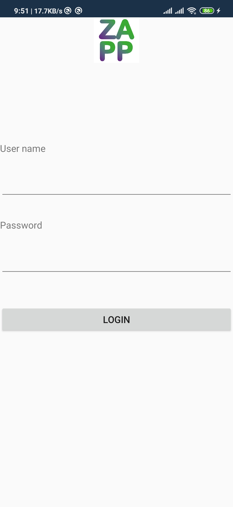
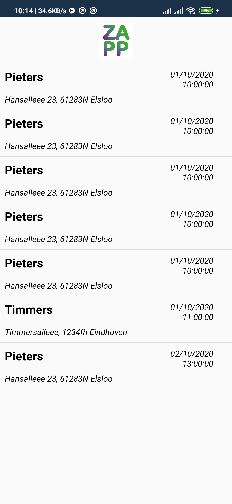
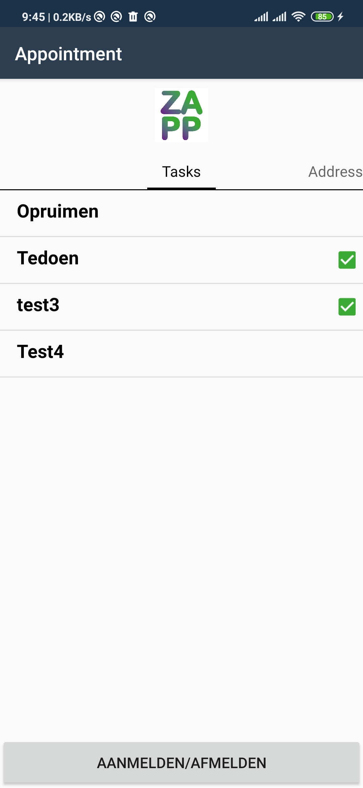

# ZappXamarin
A planning App for health workers, to plan appointments and tasks that have to be done, with a time registration. The back-end that is connected is a headless API backend, called Cockpit CMS, which can be easily installed and set up via a docker container on most servers   
## Functionality
- log-in via username and password, which has to be registered in the backend.
- For security, only the API key is saved in the app, not the password nor username
- User gets a list that is specified for him via the backend user
- Only Appointment within the next 48 hours are shown
- User can check the Tasks by clicking on them.
- If the user swipes right, the address can be found
- By clicking on the button once a starttime is registered, if pressed again an endtime is registered

  
